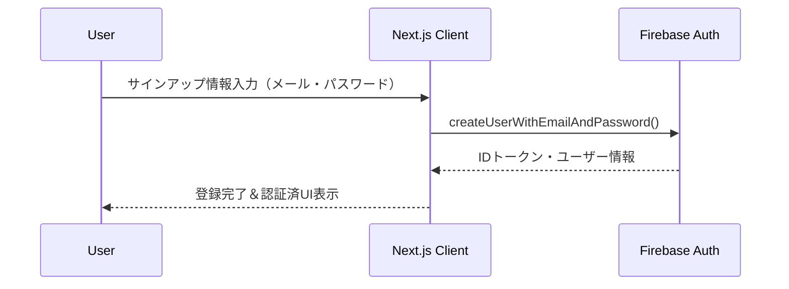
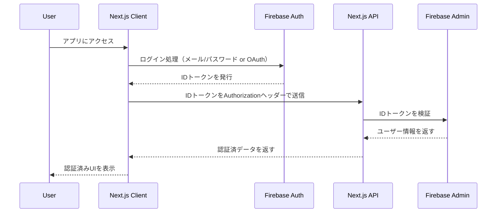
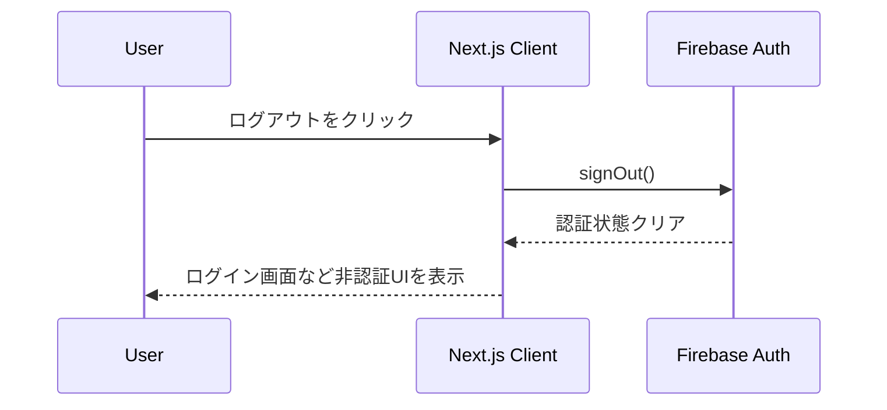
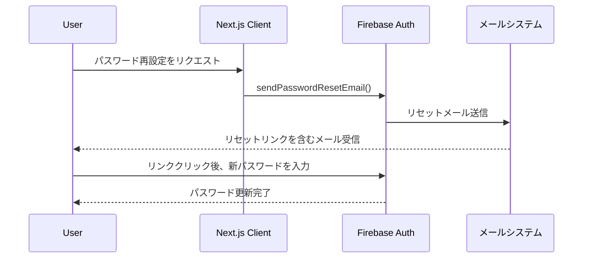
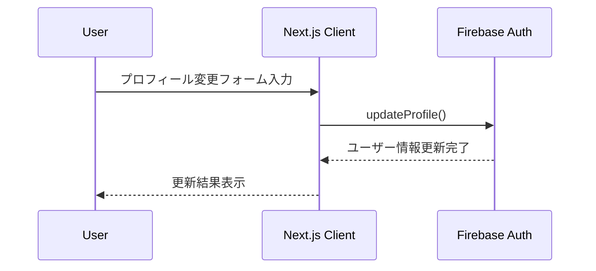
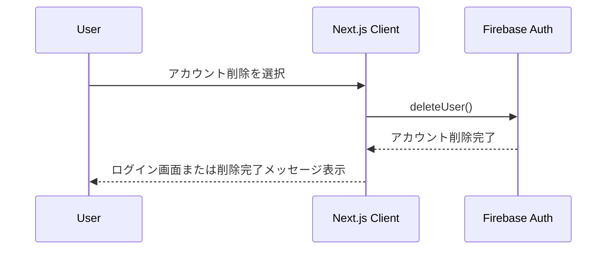

# ルーティング

| path                    | description            |
| ----------------------- | ---------------------- |
| /                       | TOP ページ             |
| /account/sign-up        | サインアップページ     |
| /account/sign-in        | サインインページ       |
| /account/password-reset | パスワード再設定ページ |
| /account/profile        | プロフィールページ     |
| /account/profile/edit   | プロフィール編集ページ |
| /account/withdrawal     | アカウント削除ページ   |
| /blogs/:id              | ブログ詳細ページ       |

# 技術スタック

Next.js の App Router を使用

## 認証サービス

Firebase Authentication を使用

# 機能概要

## 認証機能

- ヘッダーにある新規登録ボタンよりサインアップページにてアカウント登録ができます。
- ヘッダーにあるログインボタンよりサインインページにてアカウントログインができます。
- ログイン後は、ヘッダーがログイン済みの表示になり、ログアウトができます。
- サインアップページとサインインページはお互いページ遷移できます。
- サインインページでパスワードを忘れた場合に、パスワード再設定ページに遷移してパスワードリセットができます。
- プロフィールページからアカウント削除ページに遷移でき、アカウント削除を行うことができます。

## ブログ機能

- ブログ詳細ページ(/blogs/:id)では、API から取得したブログの内容を表示します。
- 各ブログ記事には会員限定フラグ（memberOnly）があり、このフラグと認証状態に基づいて表示内容が変わります：
  - 会員限定でない記事は、ログイン状態に関わらず常に全文表示されます。
  - 会員限定記事は、ログインしているユーザーには全文が表示され、未ログインのユーザーにはプレビュー内容のみが表示されます。
- 会員限定記事には「会員限定」バッジが表示されます。
- 会員限定記事を未ログインで閲覧した場合、「この記事の続きは会員限定です」というメッセージとログイン・新規登録ボタンが表示されます。

# ワークフロー

## 認証機能

サインアップ

サインイン

ログアウト

パスワード再設定

プロフィール編集

アカウント削除

