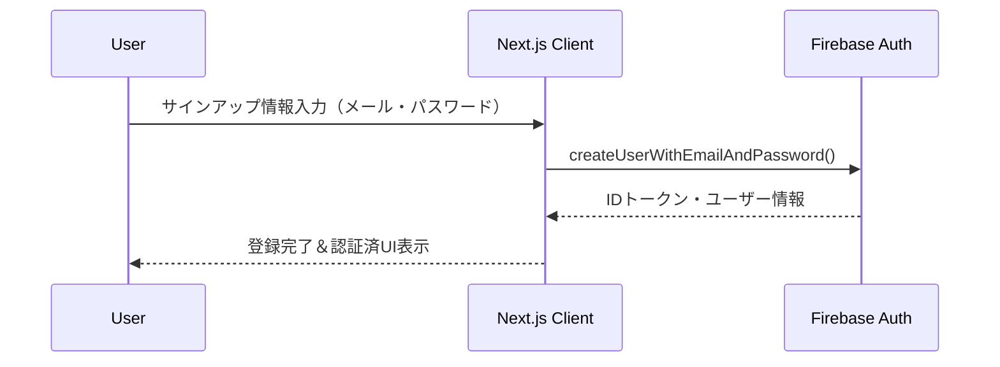
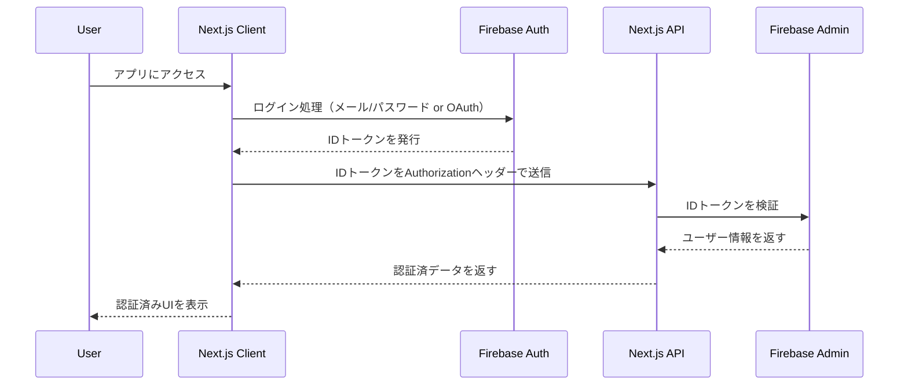
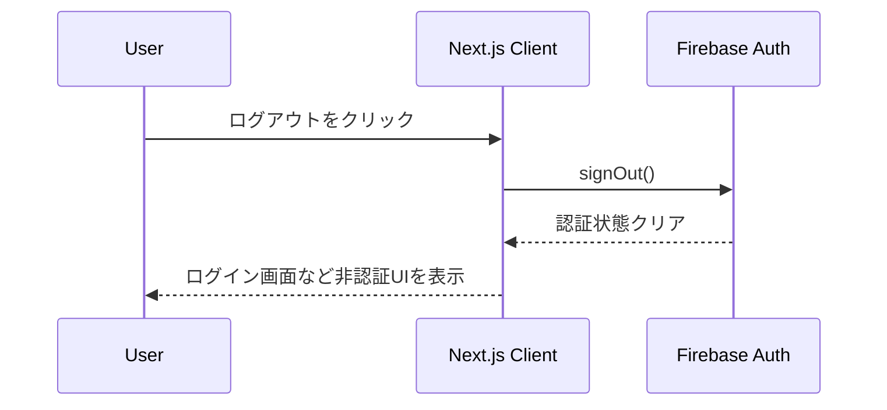
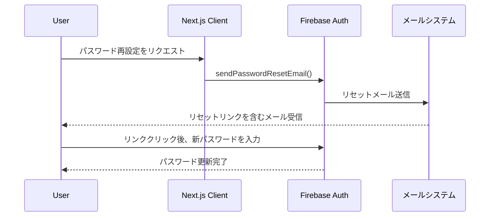
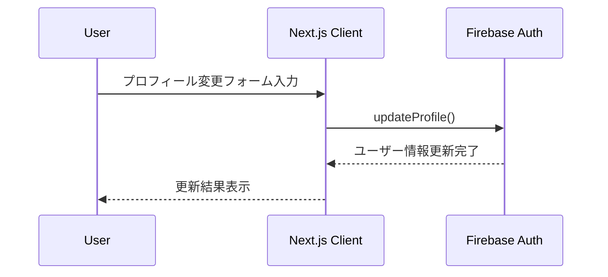
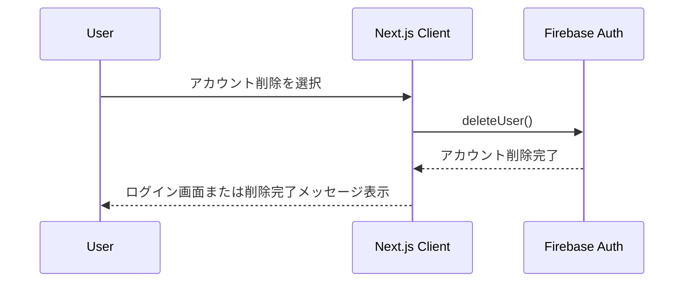

# ルーティング

| path                    | description            |
| ----------------------- | ---------------------- |
| /                       | TOP ページ             |
| /account/sign-up        | サインアップページ     |
| /account/sign-in        | サインインページ       |
| /account/password-reset | パスワード再設定ページ |
| /account/profile        | プロフィールページ     |
| /account/withdrawal     | アカウント削除ページ   |

# 技術スタック

Next.js の App Router を使用

## 認証サービス

Firebase Authentication を使用

# 機能概要

## 認証機能

- ヘッダーにある新規登録ボタンよりサインアップページにてアカウント登録ができます。
- ヘッダーにあるログインボタンよりサインインページにてアカウントログインができます。
- ログイン後は、ヘッダーがログイン済みの表示になり、ログアウトができます。
- サインアップページとサインインページはお互いページ遷移できます。
- サインインページでパスワードを忘れた場合に、パスワード再設定ページに遷移してパスワードリセットができます。
- プロフィールページからアカウント削除ページに遷移でき、アカウント削除を行うことができます。

# ワークフロー

## 認証機能

サインアップ

サインイン

ログアウト

パスワード再設定

プロフィール編集

アカウント削除

